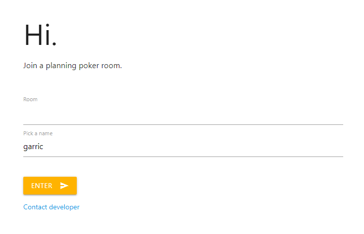
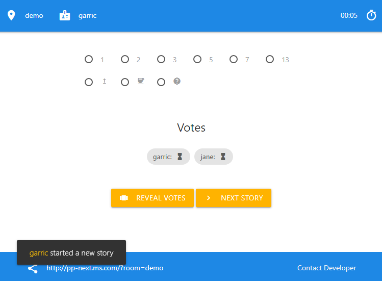
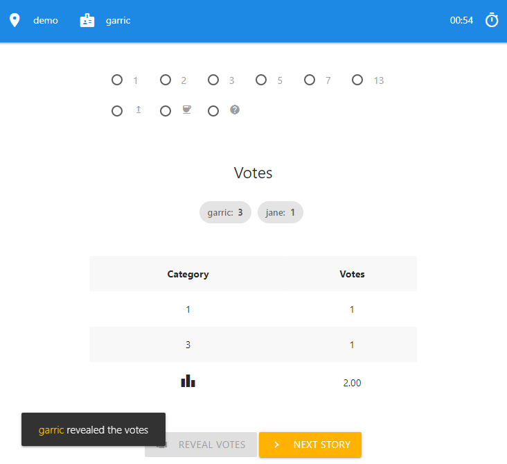

# pp-next

## about

`pp-next` is a simple planning poker website

## showcase

Join a poker room with the handle of your choice:



Voting while results are hidden:



Revealing the results:



## features

   * simple and minimalist, no registration needed
   * does not track users
   * file based persistence
   * easy to host

## getting started

   1. clone the source code:

   ```
   git clone https://github.com/garricasaurus/pp-next
   ```


   2. use [docker-compose](https://docs.docker.com/compose/) to bring up the server and the database:

   ```
   cd pp-next
   docker-compose up -d
   ```

   3. verify that the application is up:

   ```
   http://localhost:38080/
   ```

The database containing the votes will be located in the `mongo/data` directory by default.